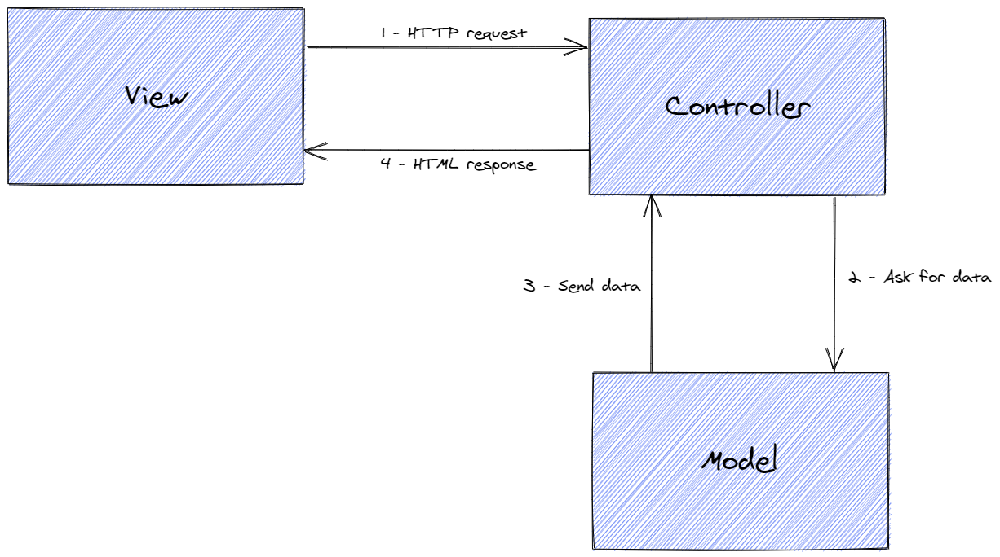
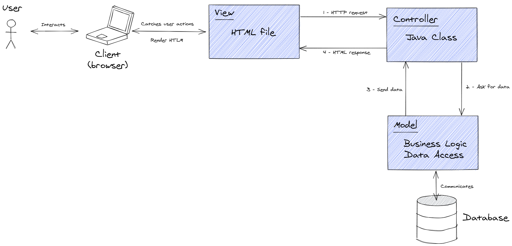
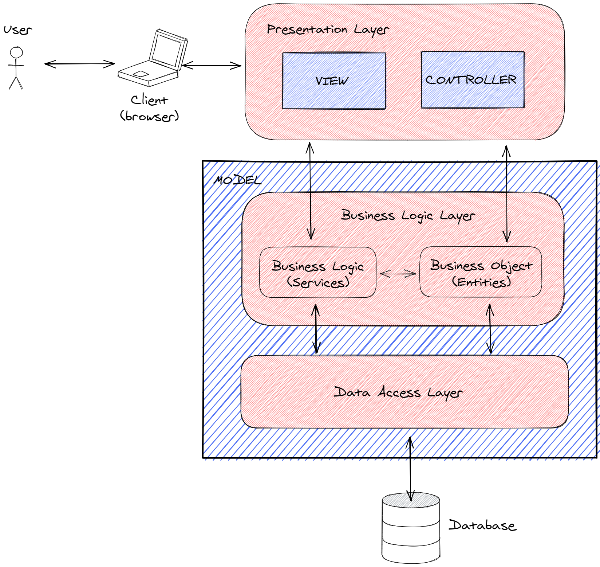
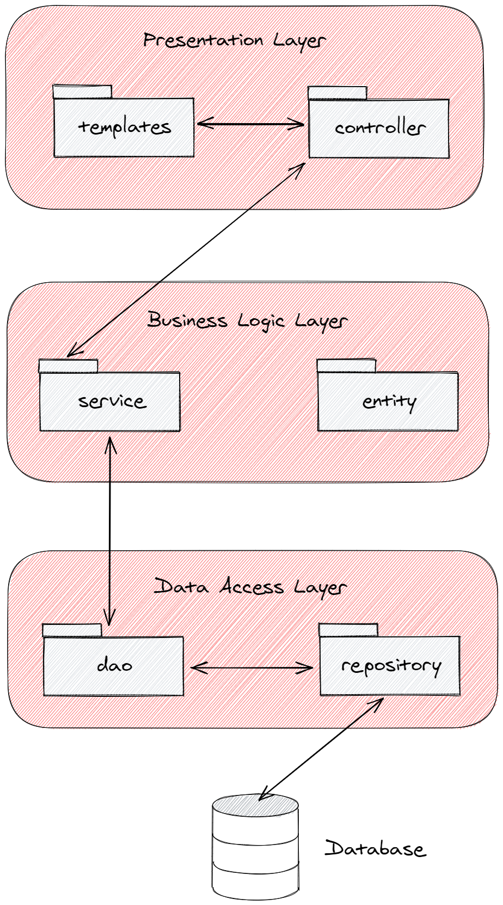

# Todo-List App

## Getting started Locally

### Using a database
Using PostgreSQL create a database.  
Then, rename the file `application-dev.properties.example` to  `application-dev.properties` and
fil it up with your database credentials.  
Make sure the variable `spring.profiles.active` is set to `dev` in the `application.properties` file.  

### Using in memory storage
You just need to set the variable `spring.profiles.active` to `memory` in the `application.properties` file

### Run tests
In a command line just type: `mvn test`

### Run the Application
In a command line just type: `mvn spring-boot:run`  
Then go to `http://localhost:8080/home`  

## Deep into it
This monolithic application was developed using MVC design pattern:  
  

Let's clarify the previous schema by adding some infos:  
  

Also, this web app was developed using a three layered architecture:  
  

Now let's represent the packages in each layer:  
  

Of course, when we use the in-memory storage the repository package, and the database are not present.  
In additions to these packages there are 4 more of them:  
- `exception` for custom exceptions
- `form` for DTOs used to display entities in html files or fill up forms
- `security` contain classes for security configuration
- `validation` for a custom annotation to validate password matches when a new customer is registered  

